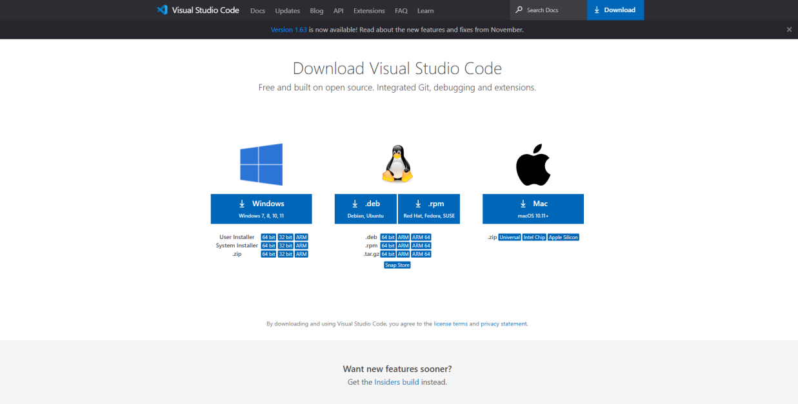
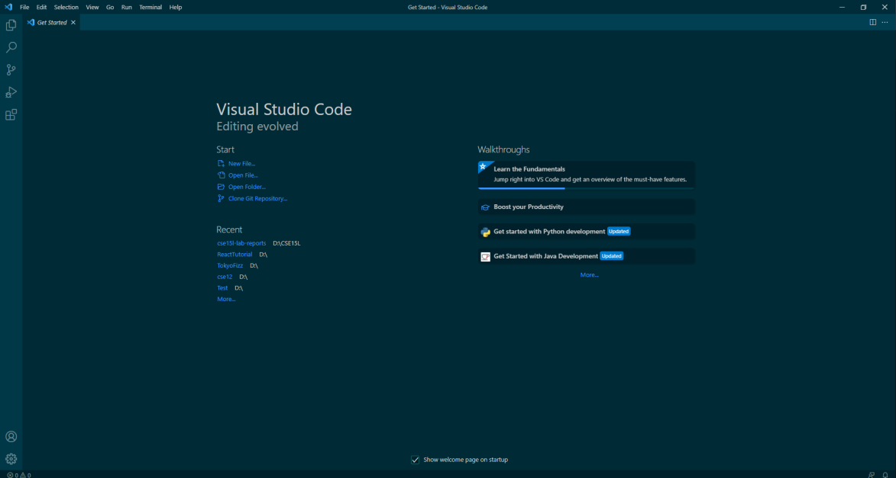
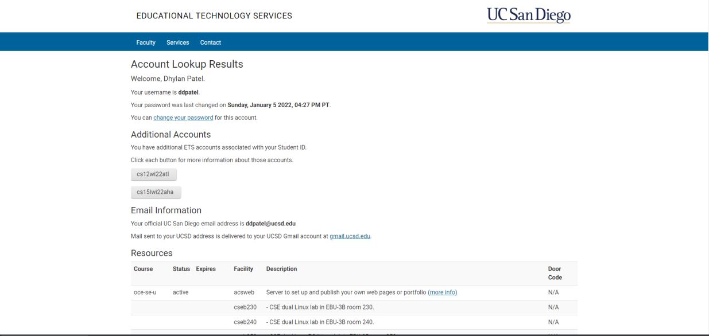

# Week 1 & 2 lab reports
1. Installing VScode

    -[Download VS Code](https://code.visualstudio.com/download)
    
    - Once downloaded, open the package and follow prompts on the screen. Click next past for all of the prompts given without making any changes unless they present immediate problems. The screen should then look like this when you open it:
    
2. Remotely Connecting
    - When remotely connecting, first start by finding your emote account email. This can be done through the link: https://sdacs.ucsd.edu/~icc/index.php . Next type in your username (the text before the @ sign of your ucsd email adress) and Student ID (with the A or U) and click the submit button. 
    - Here is what it should look like and please not the Additional Accounts tab which will have the email adress name without the domain. Please copy this for later: 
    - **Important:** Reset the password to your ucsd email account beforehand and allow 10-15 minutes for this change to proccess before proceeding
    - Next: type in the following command to login: 
    > $ ssh < email address copied>@ieng6.ucsd.edu
    - You will then get this message and select yes to all of these messages
    > ⤇ ssh cs15lwi22zz@ieng6.ucsd.edu
    >The authenticity of host 'ieng6.ucsd.edu (128.54.70.227)' can't be established. RSA key fingerprint is SHA256:ksruYwhnYH+sySHnHAtLUHngrPEyZTDl/1x99wUQcec.Are you sure you want to continue connecting (yes/no/[fingerprint])? 
    - You will then need to enter your password and should be connected.

