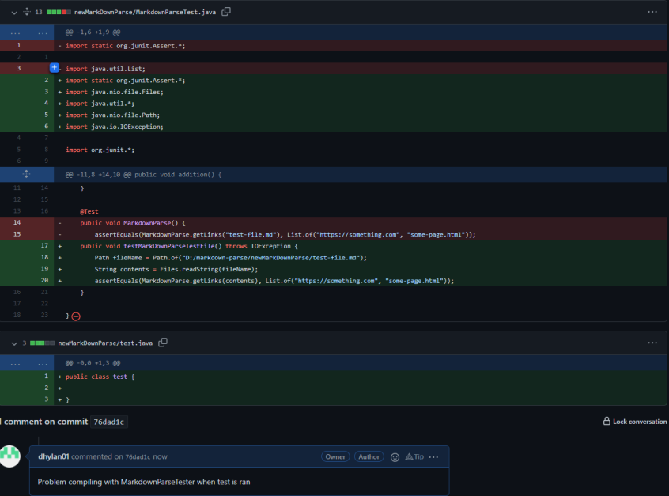
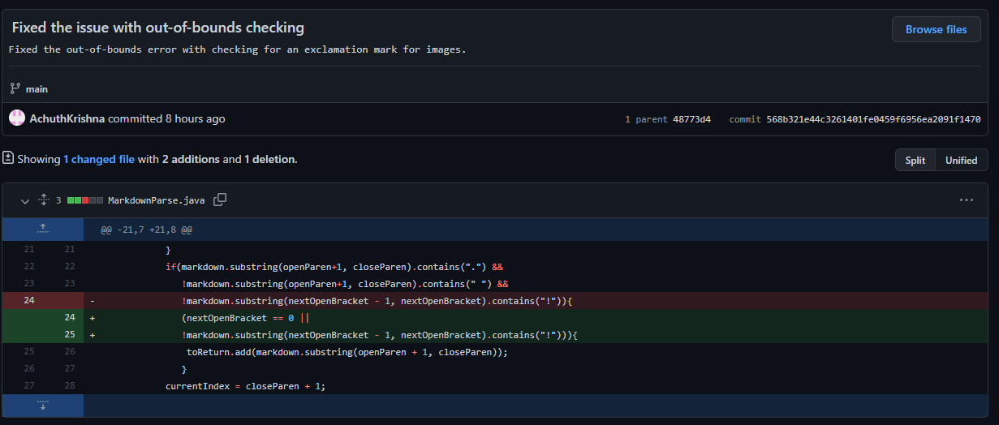
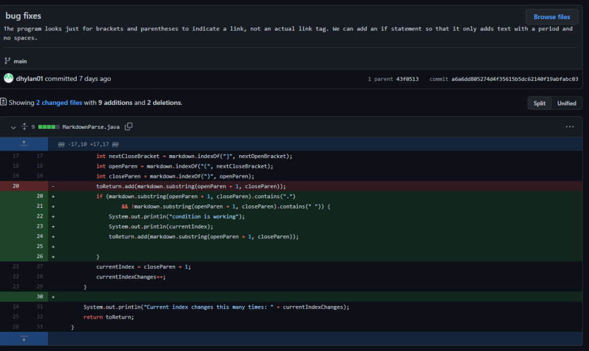

# Lap Report number 2

## First Issue

[Link to test file](https://github.com/dhylan01/markdown-parse/blob/76dad1c876e11862ada2cde6c28a4a28fa40e86b/newMarkDownParse/test-file.md)

Code after running `javac -cp ".;..\libs\junit-4.12.jar;..\libs\hamcrest-core-1.3.jar" MarkdownParseTest.java` :

`java.lang.StringIndexOutOfBoundsException: begin 0, end -1, length 12`
`at java.base/java.lang.String.checkBoundsBeginEnd(String.java:4601)`
`at java.base/java.lang.String.substring(String.java:2704)`
`at starter.MarkdownParse.getLinks(MarkdownParse.java:23)`
`at starter.MarkdownParseTest.MarkdownParse(MarkdownParseTest.java:19)`

Problem that made the test fail:

- The symptom here is that the test fails for any inputs because it has a problem with dealing with the bounds
- The failure-inducing test was all tests, but in specific the test-file
- There were many bugs for these tests but the first was that imports were missing (fixed and then ran) and also that the markdownParseTest did not have import the files correct with the fileName and contents.

## Second Issue

[Link to test file](https://github.com/dhylan01/markdown-parse/blob/76dad1c876e11862ada2cde6c28a4a28fa40e86b/newMarkDownParse/test-file.md)

Code after running: `PS D:\CSE15L\NewMarkDownParse\starter> java MarkdownParse.java test-file.md`

`[some-page.html]`

expected:

`[https://something.com, some-page.html]`

Problem that made the test fail:

- The symptom was that the code will ignore any links that have something before the brackets
- The failure-inducing input here is the first link which includes 3 exclamation marks before the first link's brackets
- The bug would then be a neglect of if statements that will ignore code before the first index of a bracket

## Third Issue

[Link to test file](https://github.com/dhylan01/markdown-parse/blob/76dad1c876e11862ada2cde6c28a4a28fa40e86b/oldMarkDownParse/break-test.md)

Code ran: `PS D:\CSE15L\NewMarkDownParse\starter> java MarkdownParse1.java break-test.md `

Terminal Output: ` ` (code did not print anything)

Problem that made the test fail:

- The symptom was that the program is that it required the input to start with [] signs, otherwise nothing would be returned.
- The failure-inducing input was thus a program that started with something other than that, like ## in this case.
- This proved that there was a bug in the way that the way the open and close brackets were handled which also caused the while loop to go infinite.
