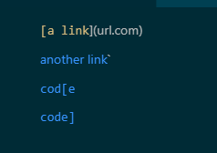
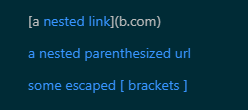
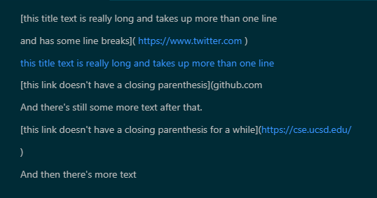

# Links to repos

[My Repo](https://github.com/dhylan01/markdown-parse1)

[Other Group's repo](https://github.com/yi113/markdown-parse)

# Snippet 1

- What it renders on VS code:



- Test:

```
    @Test
    public void testSnippet1() throws IOException {
        Path fileName = Path.of("snippet1.md");
        String contents = Files.readString(fileName);
        assertEquals(MarkdownParse.getLinks(contents), List.of("`google.com", "google.com", "ucsd.edu"));
    }
```

- Results of my implimentation with the test (expected is my result and was is correct implimentation results):

```
1) testSnippet1(MarkdownParseTest)
java.lang.AssertionError: expected:<[url.com, `google.com, google.com, ucsd.edu]> but was:<[`google.com, google.com, ucsd.edu]>
	at org.junit.Assert.fail(Assert.java:89)
	at org.junit.Assert.failNotEquals(Assert.java:835)
	at org.junit.Assert.assertEquals(Assert.java:120)
	at org.junit.Assert.assertEquals(Assert.java:146)
	at MarkdownParseTest.testSnippet1(MarkdownParseTest.java:32)
```

- Result of the reviewed implimentation (expected is my result and was is correct implimentation results):

```
1) testSnippet1(MarkdownParseTest)
java.lang.AssertionError: expected:<[url.com, `google.com, google.com]> but was:<[`google.com, google.com, ucsd.edu]>
	at org.junit.Assert.fail(Assert.java:89)
	at org.junit.Assert.failNotEquals(Assert.java:835)
	at org.junit.Assert.assertEquals(Assert.java:120)
	at org.junit.Assert.assertEquals(Assert.java:146)
	at MarkdownParseTest.testSnippet1(MarkdownParseTest.java:32)

```

# Snippet 2

- What it renders on VS code:



- Test:

```
    @Test
    public void testSnippet2() throws IOException {
        Path fileName = Path.of("snippet2.md");
        String contents = Files.readString(fileName);
        assertEquals(MarkdownParse.getLinks(contents), List.of("a.com(())", "example.com"));
    }
```

- Results of my implimentation with the test (expected is my result and was is correct implimentation results) :

```
2) testSnippet2(MarkdownParseTest)
java.lang.AssertionError: expected:<[a.com, a.com((, example.com]> but was:<[a.com, a.com(()), example.com]>
	at org.junit.Assert.fail(Assert.java:89)
	at org.junit.Assert.failNotEquals(Assert.java:835)
	at org.junit.Assert.assertEquals(Assert.java:120)
	at org.junit.Assert.assertEquals(Assert.java:146)
	at MarkdownParseTest.testSnippet2(MarkdownParseTest.java:39)
```

- Result of the reviewed implimentation (expected is my result and was is correct implimentation results) :

```
2) testSnippet2(MarkdownParseTest)
java.lang.AssertionError: expected:<[a.com, a.com((]> but was:<[a.com, a.com(()), example.com]>
	at org.junit.Assert.fail(Assert.java:89)
	at org.junit.Assert.failNotEquals(Assert.java:835)
	at org.junit.Assert.assertEquals(Assert.java:120)
	at org.junit.Assert.assertEquals(Assert.java:146)
	at MarkdownParseTest.testSnippet2(MarkdownParseTest.java:39)

```

# Snippet 3

- What it renders on VS code:



- Test:

```
    @Test
    public void testSnippet3() throws IOException {
        Path fileName = Path.of("snippet3.md");
        String contents = Files.readString(fileName);
        assertEquals(MarkdownParse.getLinks(contents),
                List.of("https://www.twitter.com", "https://ucsd-cse15l-w22.github.io/", "https://cse.ucsd.edu/"));
    }
```

- Results of my implimentation with the test (expected is my result and was is correct implimentation results) :

```
3) testSnippet3(MarkdownParseTest)
java.lang.AssertionError: expected:<[
https://www.twitter.com
, https://ucsd-cse15l-w22.github.io/]> but was:<[https://www.twitter.com, https://ucsd-cse15l-w22.github.io/, https://cse.ucsd.edu/]>
	at org.junit.Assert.fail(Assert.java:89)
	at org.junit.Assert.failNotEquals(Assert.java:835)
	at org.junit.Assert.assertEquals(Assert.java:120)
	at org.junit.Assert.assertEquals(Assert.java:146)
	at MarkdownParseTest.testSnippet3(MarkdownParseTest.java:46)
```

- Result of the reviewed implimentation (expected is my result and was is correct implimentation results) :

```
3) testSnippet3(MarkdownParseTest)
java.lang.AssertionError: expected:<[
https://www.twitter.com
, https://ucsd-cse15l-w22.github.io/, github.com

And there's still some more text after that.

[this link doesn't have a closing parenthesis for a while](https://cse.ucsd.edu/

]> but was:<[https://www.twitter.com, https://ucsd-cse15l-w22.github.io/, https://cse.ucsd.edu/]>
	at org.junit.Assert.fail(Assert.java:89)
	at org.junit.Assert.failNotEquals(Assert.java:835)
	at org.junit.Assert.assertEquals(Assert.java:120)
	at org.junit.Assert.assertEquals(Assert.java:146)
	at MarkdownParseTest.testSnippet3(MarkdownParseTest.java:46)

```

# Question answers

1. Yes. I think that there is a small code change that will make my program work for snippet 1. I think that right before I add the link to the array I could check for any backtick or elements that are not a letter possible to start a link with. This would not count the " ` " that my MarkdownParse incorrectly added as a part of the link.

2. I thnk that this might be a longer change. That is because it would involve the case of checking for nested parenthesis which can be quite hard because any link nested in the brackets needs to be counted as a link as well. This would be its own seperate case to check for while the case of excluded brackets which would also be its own seperate case. These two cases might even require a change in the way that the next open / close bracket and parenthesis index variables are handled

3. Yes. For this case my implimentation missed the last link because of the space in between the end of the link and the end parenthesis. For this one it would be a simple way of making close paren the next index of a close paren and then just making sure that the sting is correctly trimmed for any spaces that might get added to the link with the addition of a new line.
