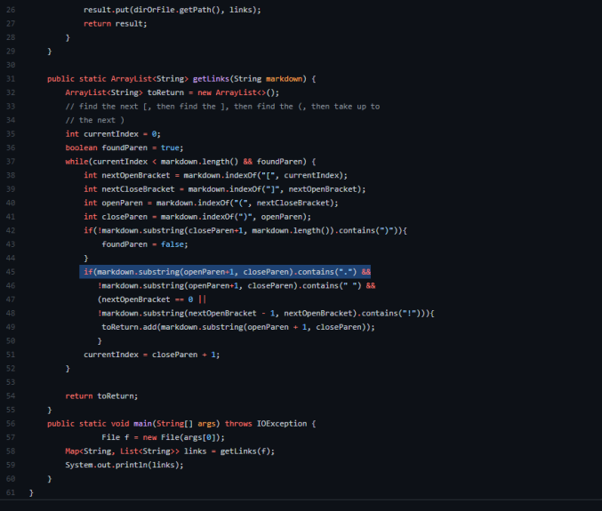

# Lab Report 5

## Running test swith differnt results

- In order to search for differences in the two test files we first created a script to look at the two files:
```
for file in test-files/*.md;
do
  echo $file
  java MarkdownParse $file
done
```
- On the command line we put the outputs of all of the test into a results.txt file: 
```
bash script.sh > results.txt
```
- We repeated it for the other implimentation of markdown parse and then compared the two files using the "diff" command:
```
diff markdown-parse/results.txt markdown-parse-week9/results.txt
```

## Test 342
- Contents of the test file:
```
[not a link](/foo)

```

- Expected output of test (no links): 
```
[]
```
- Here is the output of our Markdown Parse (nothing meaning an exception was thrown most likely):
```

```
- Here is the output of the provided Markdown Parse:
```
[/foo`]
```
- The reason why our test might have failed was that the line highlighted below does not correctly check the material inside of the parenthesis. Here it might be possible to add in a check that would look at the eactual link part inside fo the parenthesis. In this case it might suffice to check if the beggining fo the link contains "/" at the first index or to check if there is a "www." or "https:" as the first parts before the link.


[Link to the line on GitHub](https://github.com/ucsd-cse15l-w22/markdown-parse/blob/44a15db11dbadaa0053f1308fa4f9a6336153b31/MarkdownParse.java#L75)

## Test 418

- Contents of file:
```
*foo [*bar*](/url)*
```

- Expected output of test : 
```
[ /url]
```

- Here is the output of our Markdown Parse (nothing meaning an exception was thrown most likely):
```
```

- Here is the output of the provided Markdown Parse:
```
[/url]
```
- The error for our MarkDown Parse might be in the line that requires a period to be in the string being examined for a link in order for it to be counted as a link. This might be why the link "/url" was not added into the array to be counted as a link. 


[Link the the line on github](https://github.com/aryand10/markdown-parse/blob/2eec42f065e0aca2cd994ea0b4318e1e240a2f0d/MarkdownParse.java#L45)