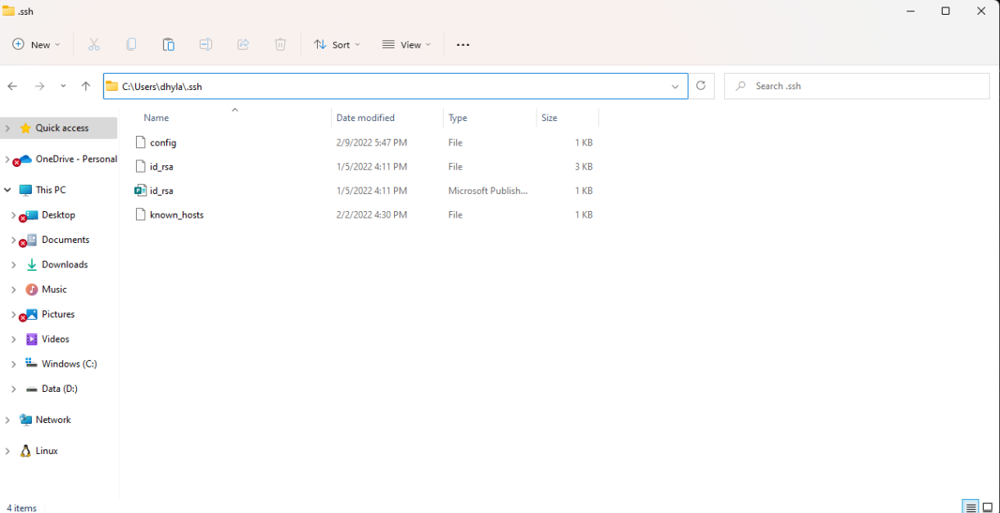
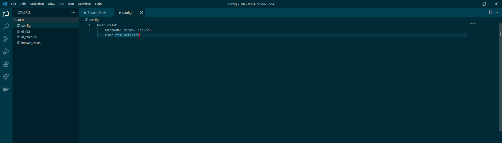
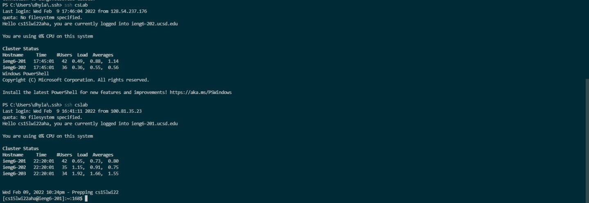
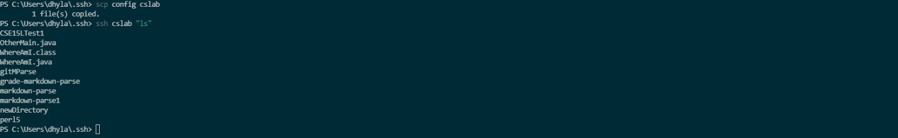

# Lap Report number 3

## Showing my config file and how I edited it

- Opened Visual Studio Code and clicked the file button on the top right and then open folder. It also might be on the screen when you open it.

- Next navigate to .ssh folder and clicked open to open and edit in VsCode

- From Here we can directly edit all files in the folder directly in vsCode and will now create a new file called config and add in the following code: `Host cslab HostName ieng6.ucsd.edu User cs15lwi22aha`
- This is shown in the image below as well

## Show the ssh command for logging in

- I used the command `ssh cslab ` but use whatever name directly follows host in the config file shown above

## Show that the scp command works to copy a file

- We can use the command: `scp (insert name of file) (insert hostname used in previous step` . There is also an image below that demonstractes this.

